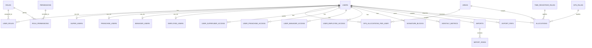

# Minimum ERD

```mermaid
erDiagram
    USERS ||--o{ USER_ROLES : has
    ROLES ||--o{ USER_ROLES : assigned_to
    ROLES ||--o{ ROLE_PERMISSIONS : grants
    PERMISSIONS ||--o{ ROLE_PERMISSIONS : included_in

    USERS ||--o| SUPER_USERS : can_be
    USERS ||--o| FRANCHISE_USERS : can_be
    USERS ||--o| MANAGER_USERS : can_be
    USERS ||--o| EMPLOYEE_USERS : can_be

    USERS ||--o{ GPS_ALLOCATIONS_PER_USER : has
    AREAS ||--o{ GPS_ALLOCATIONS_PER_USER : scopes

    USERS ||--o{ USER_SUPERUSER_ACCESS : grants
    USERS ||--o{ USER_FRANCHISE_ACCESS : has
    USERS ||--o{ USER_MANAGER_ACCESS : has
    USERS ||--o{ USER_EMPLOYEE_ACCESS : has

    USERS ||--o{ SIGNATURE_BLOCKS : has
    USERS ||--o{ MONTHLY_METRICS : owns
    USERS ||--o{ IMPORTS : creates
    IMPORTS ||--o{ IMPORT_ROWS : contains
    USERS ||--o{ EXPORT_PDFS : requests

    USERS ||--o{ ALLOCATIONS : receives
    AREAS ||--o{ ALLOCATIONS : scopes
    TIME_REGISTRAR_RULES ||--o{ ALLOCATIONS : applies
    GPS_RULES ||--o{ ALLOCATIONS : applies
```

- attendance_events
